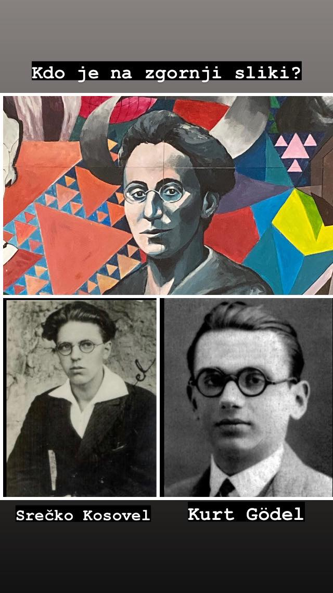

# Polynomial-identity-testing
Project at course Računska zahtevnost 2023/24.

# Okvirni potek predstavitve

Lahko se še kaj spreminja, prilagaja, izpusti...

## Filip

- Motivacija z enostavnim primerom in neenostavnim primerom

- PIT can be transformed in question "Is a certain polynomial equal to 0?"

- Arithmetic circuits

- enostavni primer reprezentiran z arithmetic circuitsi

- official defininicija PIT problema (mjbi kaj so words, kaj je alphabet, da je PIT decision problem)

## Uroš

- S-Z lemma

- dokaz?

- Probalistic algorithm for PIT (fingerprinting)

- lahko mogoče na enostavnem primeru pokazana izvedba algoritma 

## Dejan

- Definicija BPP (Simpson prevč na hitr to definirov, treba se spomnit)

- Show that PIT $\in$ BPP because of defined probalistic algorithm 

- Ni znano (še) da je PIT $\in$ P, other problems that are in BPP but not in P 

- primality testing was known to be that sort of problem but other group showed/will show that is also in P (AKS primality testing)

- če je še čas : applications of probabilistic algorithm (sets of integer are same, primality testing, perfect matching)

